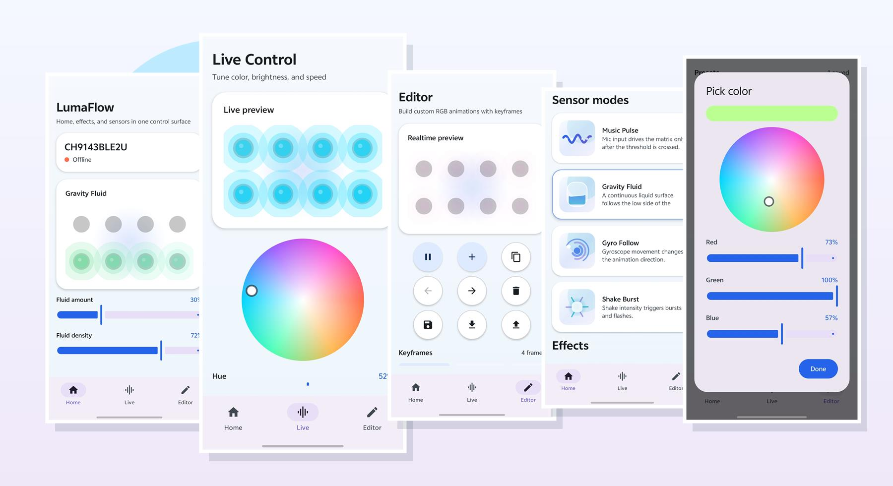
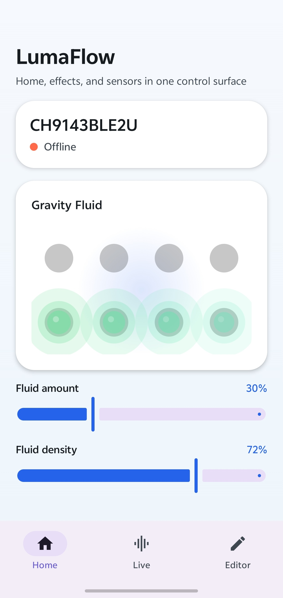
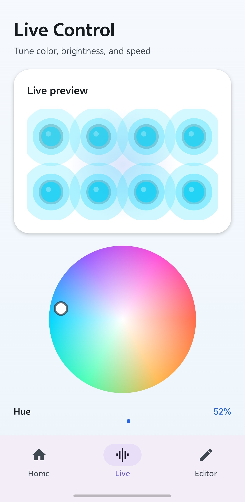
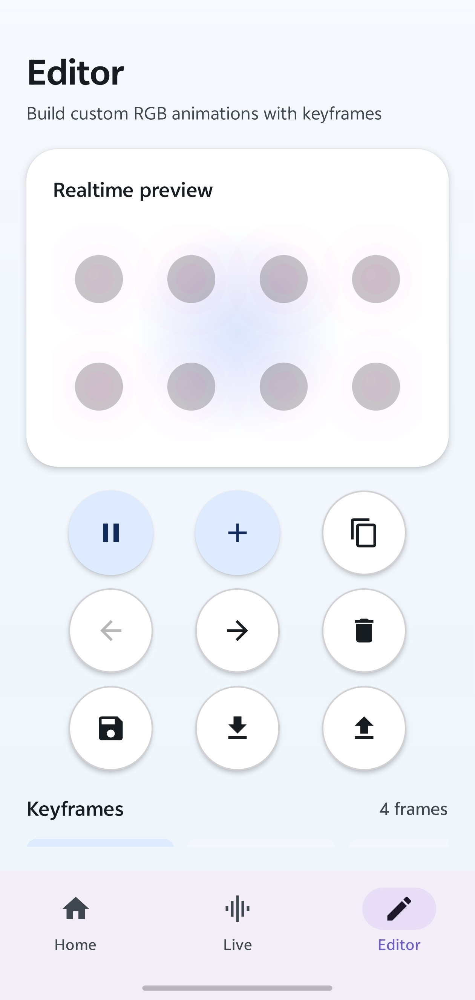
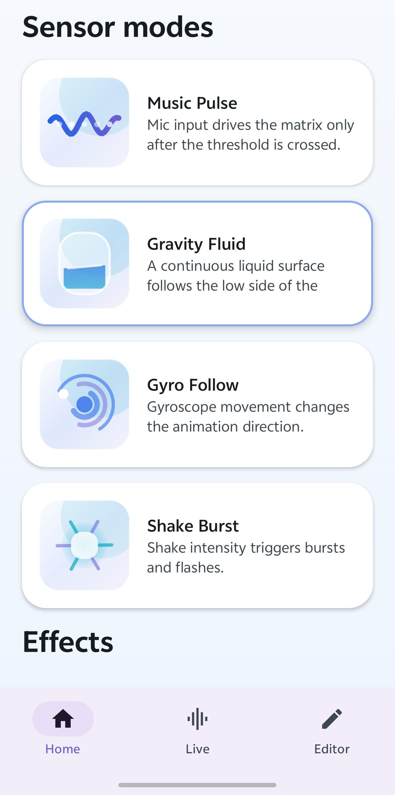
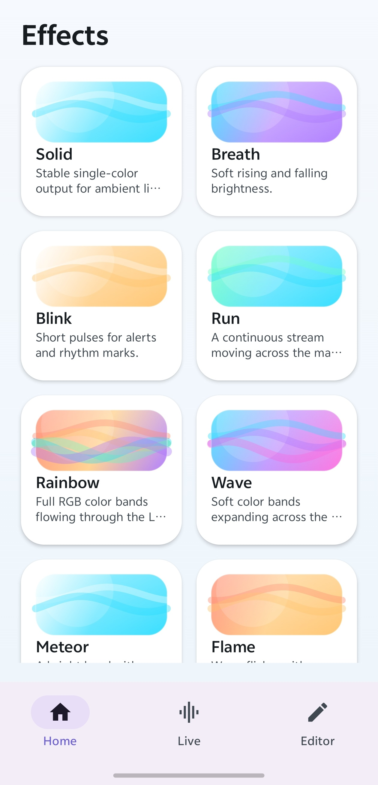
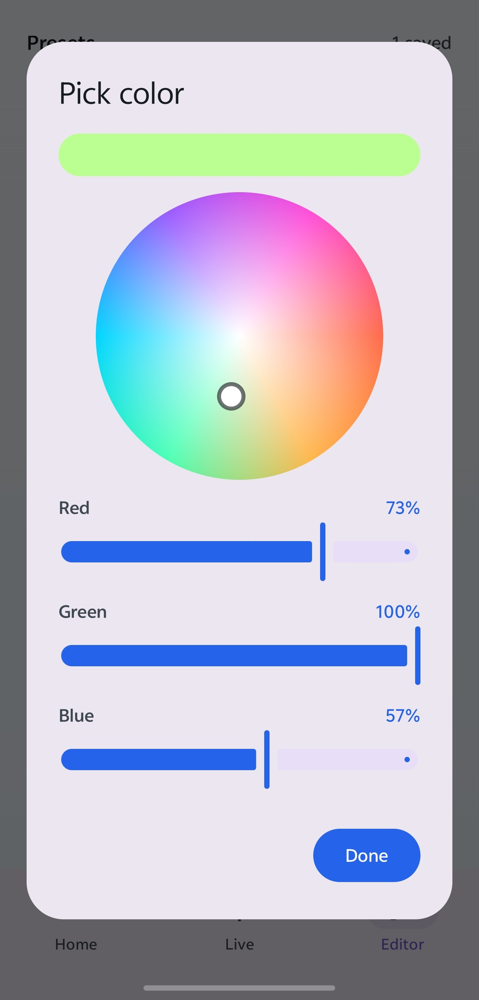
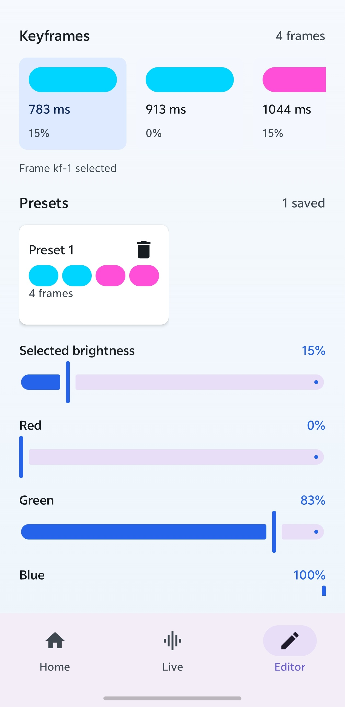
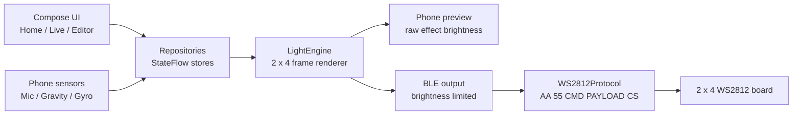
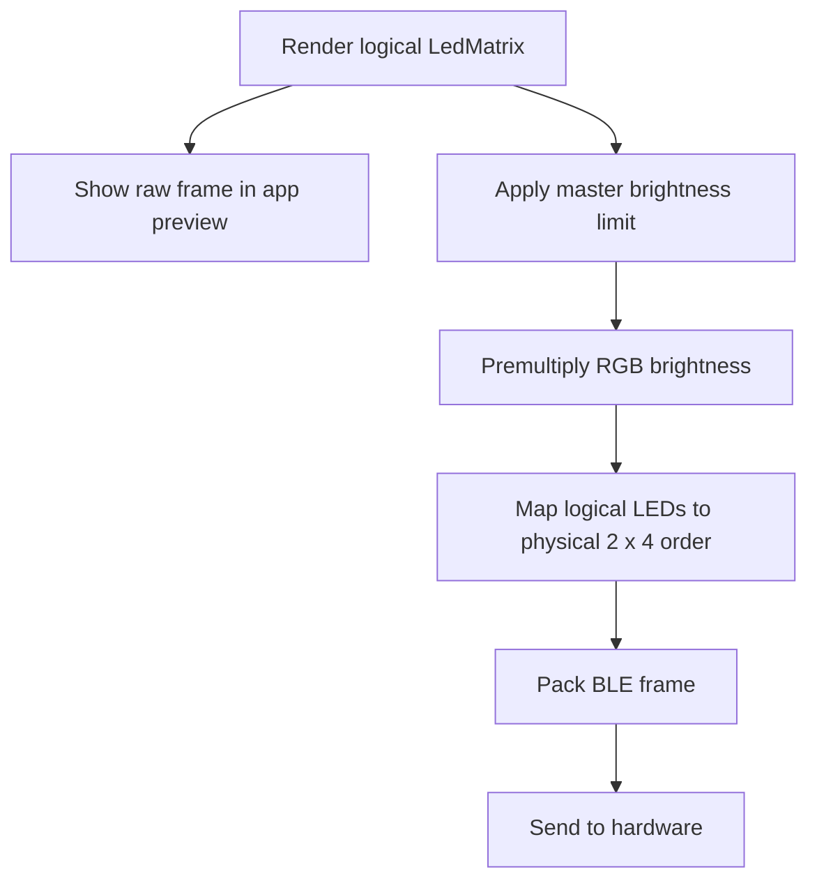

<p align="center">
  
</p>

<h1 align="center">LumaFlow</h1>

<p align="center">
  <strong>A polished Android light controller for a 2 x 4 WS2812 RGB matrix.</strong>
</p>

<p align="center">
  Live color control, sensor-driven effects, keyframe editing, and BLE hardware output in one compact app.
</p>

<p align="center">
  <a href="#quick-start"></a>
  <a href="#tech-stack"></a>
  <a href="#tech-stack"></a>
  <a href="./BLUETOOTH_WS2812_PROTOCOL.md"></a>
</p>

<p align="center">
  <a href="#why-lumaflow">Why LumaFlow</a>
  ·
  <a href="#screens">Screens</a>
  ·
  <a href="#architecture">Architecture</a>
  ·
  <a href="#quick-start">Quick Start</a>
  ·
  <a href="./BLUETOOTH_WS2812_PROTOCOL.md">Protocol</a>
</p>

<p align="center">
  
</p>

## Why LumaFlow

LumaFlow turns a phone into a real-time control surface for a small RGB matrix. It renders light effects locally, previews the 2 x 4 LED layout on screen, reads motion and microphone input, then streams the final frame to hardware over Bluetooth LE.

<table>
  <tr>
    <td><strong>Live by touch</strong></td>
    <td>Pick hue, RGB values, brightness, and speed with direct controls built for quick visual tuning.</td>
  </tr>
  <tr>
    <td><strong>Effects with feel</strong></td>
    <td>Breath, wave, runner, sparkle, music pulse, gravity fluid, gyro follow, and shake burst are rendered in-app.</td>
  </tr>
  <tr>
    <td><strong>Editor included</strong></td>
    <td>Create keyframe animations, save presets, delete history, and import or export configurations.</td>
  </tr>
  <tr>
    <td><strong>Hardware-aware</strong></td>
    <td>Preview keeps raw effect brightness, while BLE output applies the global brightness limit for bright physical LEDs.</td>
  </tr>
</table>

## Screens

<table>
  <tr>
    <td width="33%" align="center">
      
      <br />
      <strong>Gravity Fluid</strong>
    </td>
    <td width="33%" align="center">
      
      <br />
      <strong>Live Control</strong>
    </td>
    <td width="33%" align="center">
      
      <br />
      <strong>Keyframe Editor</strong>
    </td>
  </tr>
  <tr>
    <td width="33%" align="center">
      
      <br />
      <strong>Sensor Modes</strong>
    </td>
    <td width="33%" align="center">
      
      <br />
      <strong>Effect Catalog</strong>
    </td>
    <td width="33%" align="center">
      
      <br />
      <strong>Color Picker</strong>
    </td>
  </tr>
  <tr>
    <td width="33%" align="center"></td>
    <td width="33%" align="center">
      
      <br />
      <strong>Presets</strong>
    </td>
    <td width="33%" align="center"></td>
  </tr>
</table>

## Feature Map

| Surface | What it does |
| --- | --- |
| Home | Device status, sensor modes, effect catalog, and contextual controls |
| Live | Realtime matrix preview, color wheel, RGB sliders, brightness, and speed |
| Editor | Keyframes, playback, duplicate/delete/move controls, presets, import, and export |
| Device | BLE scan, connection state, and device selection |
| Settings | Global brightness limit and app-level animation speed |

## Effects

| Effect | Behavior | Controls |
| --- | --- | --- |
| Solid | Stable single-color output | Color, brightness |
| Breath | Nonlinear 255 -> 0 -> 255 brightness curve | Color, speed, brightness |
| Run | Continuous stream across the matrix | Color, speed |
| Wave | Soft bands expanding across LEDs | Color, speed |
| Music Pulse | Microphone RMS level drives brightness after threshold | Threshold, color |
| Gravity Fluid | Tilt controls a continuous liquid surface | Fluid amount, density |
| Gyro Follow | Gyroscope movement changes animation direction | Motion, color |
| Shake Burst | Shake intensity triggers bursts and flashes | Motion, color |

## Architecture





## Hardware Target

LumaFlow currently targets an 8 LED WS2812 matrix arranged as 2 rows by 4 columns. The app sends binary BLE frames using the protocol documented in [BLUETOOTH_WS2812_PROTOCOL.md](./BLUETOOTH_WS2812_PROTOCOL.md).

```text
AA 55 CMD PAYLOAD CS
```

For animated effects, the app sends a complete 8 LED frame so each pixel can carry its own RGB and brightness state.

## Quick Start

Clone and build with the Gradle wrapper:

```powershell
.\gradlew.bat assembleDebug
```

The debug APK is generated at:

```text
app/build/outputs/apk/debug/app-debug.apk
```

Run unit tests:

```powershell
.\gradlew.bat test
```

If Windows keeps serving an old APK, remove the previous output first:

```powershell
Remove-Item -LiteralPath "app\build\outputs\apk\debug\app-debug.apk" -Force
.\gradlew.bat assembleDebug
```

## Tech Stack

| Layer | Tech |
| --- | --- |
| Language | Kotlin |
| UI | Jetpack Compose, Material 3 |
| State | ViewModel, StateFlow |
| Navigation | Navigation Compose |
| Sensors | Android Sensor APIs, AudioRecord |
| Transport | Bluetooth LE GATT |
| Hardware protocol | WS2812 frame protocol over BLE serial |

Project config:

```text
applicationId = com.example.rgbcontrller
minSdk        = 26
targetSdk     = 36
versionName   = 1.0
```

## Project Layout

```text
app/src/main/java/com/example/rgbcontrller/
  data/
    bluetooth/       BLE service and WS2812 frame packing
    mock/            repositories, sensors, animation clocks, local stores
  domain/
    engine/          effect renderer
    model/           app, device, light, sensor, keyframe models
    repository/      repository contracts
  presentation/
    navigation/      Compose navigation
    screens/         Home, Live, Editor, Device, Settings
    ui/components/   shared UI controls and matrix preview
  ui/theme/          color, type, Material theme
```

## Test Coverage

- WS2812 frame packing and checksum.
- 2 x 4 physical LED mapping.
- Master brightness limiting and RGB premultiplication.
- Breathing and dynamic effect brightness behavior.
- Continuous brightness in gravity mode.
- Editor keyframes, presets, import, and export.
- Settings repository and sensor-related state.

## Roadmap

- Add stronger BLE diagnostics and connection error messages.
- Add Compose previews or screenshot tests for important screens.
- Make matrix size and physical wiring configurable per device.
- Improve Editor timeline drag sorting and batch editing.
- Add real BLE service UUID and characteristic UUID details to the hardware protocol document.
