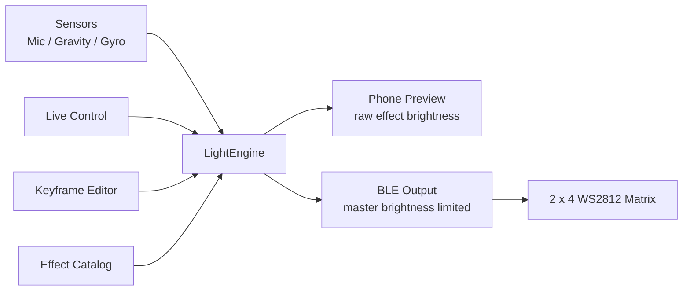
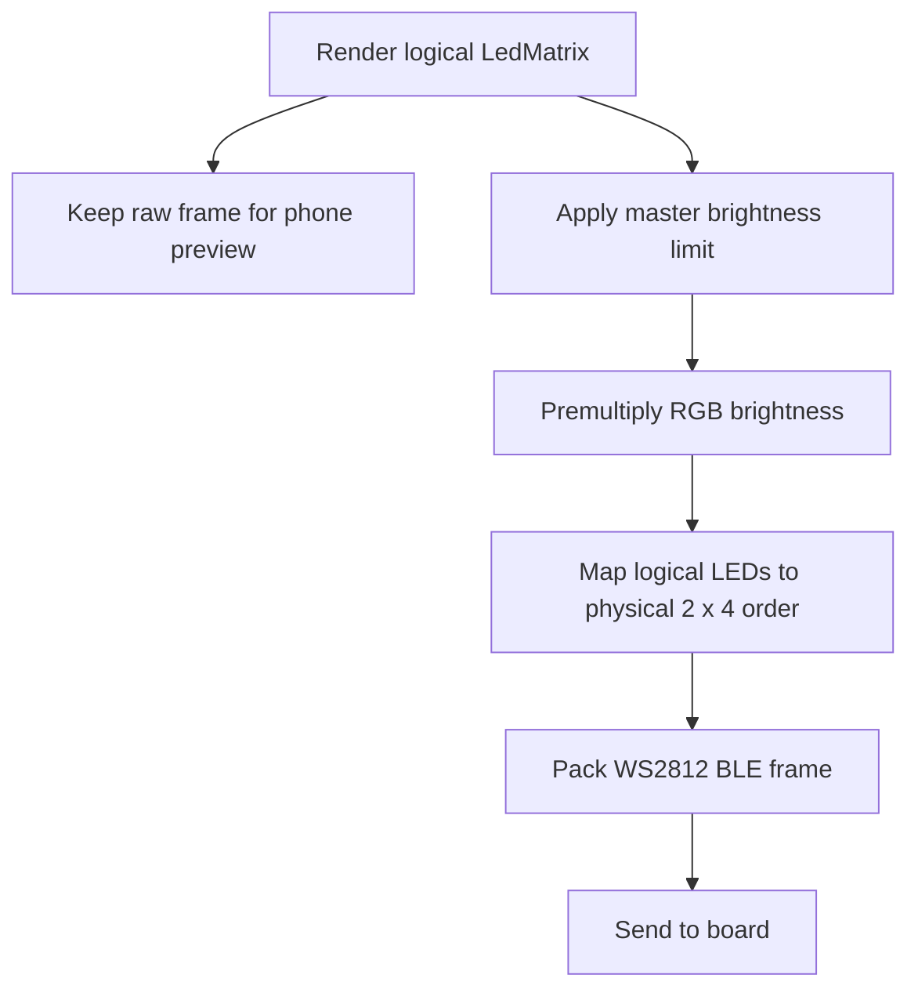

<div align="center">

# LumaFlow

### A tactile Android controller for a tiny WS2812 light matrix

把手机变成 2 x 4 RGB 灯板的实时控制台：选效果、调颜色、用传感器驱动灯光，再通过 BLE 把每一帧送到硬件。

[](#)
[](#)
[](#)
[](#)

</div>

---

## What It Is

LumaFlow 是一个面向 **2 x 4 WS2812 RGB LED 矩阵** 的 Android 控制 App。它不只是发颜色值，而是在手机端完整渲染灯效、预览矩阵状态、读取传感器输入，并通过 BLE 把最终灯光帧发送到 FPGA 或下位机。

这个项目的核心目标是：让小灯板的调试像调一个真正的灯光乐器一样直观。

## Highlights

| Area | Details |
| --- | --- |
| Live Control | 颜色盘、RGB 滑条、亮度、速度控制，适合快速试色和现场调光 |
| Effect Engine | Static、Breath、Runner、Wave、Sparkle、Music、Gravity、Gyro、Shake 等效果 |
| Editor | 关键帧时间轴、预设保存/选择/删除、配置导入/导出、弹窗取色器 |
| Preview | 手机预览只显示效果自身亮度，不叠加全局亮度限制，细微变化更容易看见 |
| Hardware Safety | 全局最大亮度只作用在硬件输出端，适合高亮 WS2812 灯板 |
| Smooth Motion | 动画时钟连续推进，速度滑动不会导致当前颜色突然跳变 |
| Gravity Fluid | 根据手机倾斜做连续亮度采样，并映射到实际 2 x 4 灯板布线 |
| BLE Protocol | 使用 `AA 55 CMD PAYLOAD CS` 二进制帧协议，支持整帧发送 |

## Light Effects

| Effect | Behavior | Tunable |
| --- | --- | --- |
| Static | 固定颜色和亮度 | Color, Brightness |
| Breath | 非线性 255 -> 0 -> 255 呼吸曲线 | Color, Speed, Brightness |
| Runner | 沿矩阵移动的跑灯 | Speed, Color |
| Wave | 波形亮度流动 | Speed, Color |
| Sparkle | 随机闪烁颗粒感 | Speed, Color |
| Music Pulse | 麦克风 RMS 音量触发 | Threshold, Color |
| Gravity Fluid | 手机倾斜驱动连续液面 | Sensor Tilt, Color |
| Gyro Follow | 陀螺仪方向响应 | Motion, Color |
| Shake Burst | 晃动强度触发亮度爆发 | Motion, Color |

## Interaction Model



## Hardware Output Pipeline



## Screens

| Screen | Purpose |
| --- | --- |
| Home | 效果选择、传感器模式、设备状态和矩阵预览 |
| Live | 即时调色、调亮度、调速度 |
| Editor | 关键帧动画制作、预设管理、配置导入导出 |
| Device | BLE 设备扫描、连接和状态查看 |
| Settings | 全局亮度限制、动画速度等应用级参数 |

## Tech Stack

| Layer | Tech |
| --- | --- |
| Language | Kotlin |
| UI | Jetpack Compose, Material 3 |
| State | ViewModel, StateFlow |
| Navigation | Navigation Compose |
| Sensors | Android Sensor APIs, AudioRecord |
| Transport | Bluetooth LE GATT |
| Hardware Protocol | WS2812 frame protocol over BLE serial |

Project config:

```text
applicationId = com.example.rgbcontrller
minSdk        = 26
targetSdk     = 36
versionName   = 1.0
```

## Project Layout

```text
app/src/main/java/com/example/rgbcontrller/
  MainActivity.kt
  data/
    bluetooth/       BLE service and WS2812 protocol packing
    mock/            repositories, sensors, animation clocks, local stores
  domain/
    engine/          effect renderer
    model/           app, device, light, sensor, keyframe models
    repository/      repository contracts
  presentation/
    navigation/      Compose navigation
    screens/         Home, Live, Editor, Device, Settings
    ui/components/   shared UI controls and matrix preview
  ui/theme/          color, type, Material theme
```

Important files:

```text
app/src/main/java/com/example/rgbcontrller/domain/engine/LightEngine.kt
app/src/main/java/com/example/rgbcontrller/data/mock/MockRepositories.kt
app/src/main/java/com/example/rgbcontrller/data/bluetooth/Ws2812Protocol.kt
app/src/main/java/com/example/rgbcontrller/data/bluetooth/AndroidBluetoothService.kt
app/src/main/java/com/example/rgbcontrller/presentation/screens/dashboard/DashboardScreen.kt
app/src/main/java/com/example/rgbcontrller/presentation/screens/live/LiveControlScreen.kt
app/src/main/java/com/example/rgbcontrller/presentation/screens/editor/EditorScreen.kt
```

## Build

Run tests:

```powershell
.\gradlew.bat test
```

Build debug APK:

```powershell
.\gradlew.bat assembleDebug
```

APK output:

```text
app/build/outputs/apk/debug/app-debug.apk
```

If Windows keeps showing an old APK, remove the previous output first:

```powershell
Remove-Item -LiteralPath "app\build\outputs\apk\debug\app-debug.apk" -Force
.\gradlew.bat assembleDebug
```

## BLE Protocol

The hardware protocol is documented in [BLUETOOTH_WS2812_PROTOCOL.md](BLUETOOTH_WS2812_PROTOCOL.md).

Frame shape:

```text
AA 55 CMD PAYLOAD CS
```

The app sends binary bytes, not ASCII hex strings. For animated effects, it uses the 8 LED frame command so every LED can carry its own RGB and brightness state.

## Test Coverage

Current unit tests cover:

- WS2812 frame packing and checksum.
- 2 x 4 physical LED mapping.
- Master brightness limiting and RGB premultiplication.
- Breathing and dynamic effect brightness behavior.
- Continuous brightness in gravity mode.
- Editor keyframes, presets, import, and export.
- Settings repository and sensor-related state.

## Roadmap

- Add stronger BLE diagnostics and connection error messages.
- Add Compose previews or screenshot tests for important screens.
- Make matrix size and physical wiring configurable per device.
- Improve Editor timeline drag sorting and batch editing.
- Add real BLE service UUID and characteristic UUID details to the hardware protocol document.
